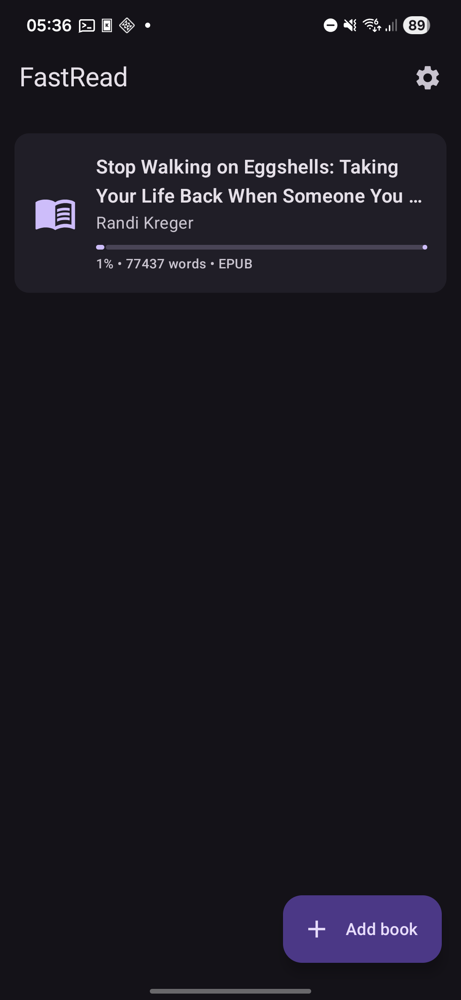
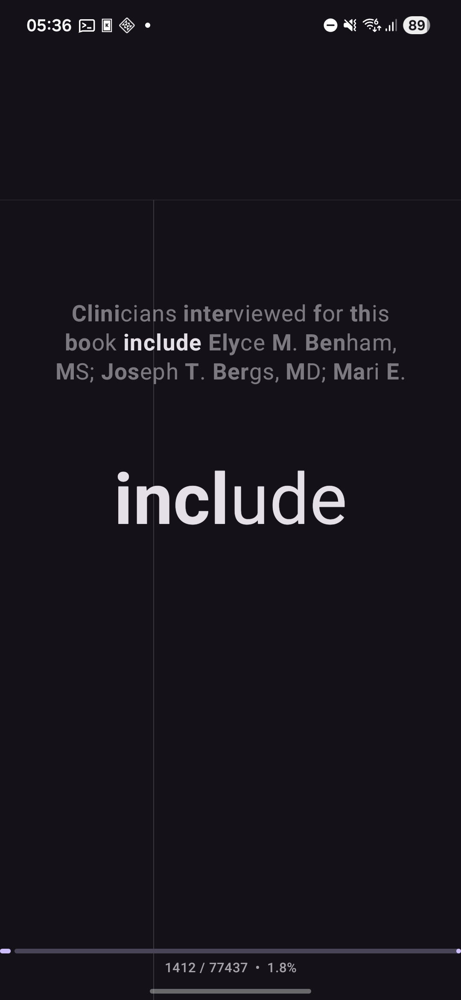
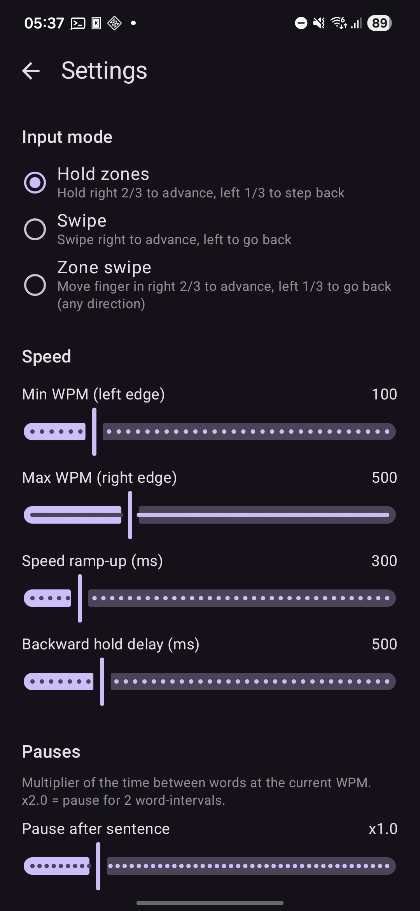
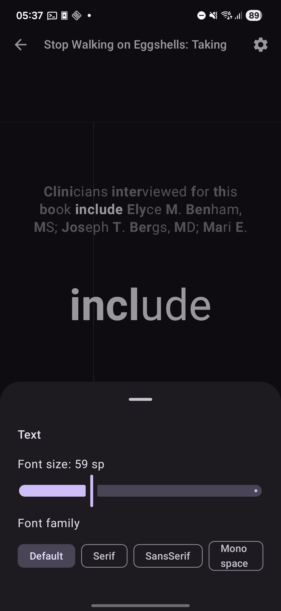

# FastRead

**A speed-reading (RSVP) app for Android that turns your EPUB and MOBI library into one-word-at-a-time bursts you control with a single gesture.**

FastRead is built for people who already have a shelf full of `.epub` and `.mobi` files and want a focused, distraction-free way to plow through them faster. No accounts, no cloud, no tracking, no ads, no network permission. Your books stay on your device.

---

## Screenshots

| Library | Reader |
| :---: | :---: |
|  |  |
| Browse your imported EPUBs and MOBIs with progress bars. | One word at a time with a three-line context window. Bionic mode on. |

| Settings | Quick settings |
| :---: | :---: |
|  |  |
| Tweak input mode, speed, pauses, fonts, bionic, theme. | In-reader sheet for live font and size changes. |

---

## Why FastRead

Most RSVP apps either bury you in buttons, lock features behind a subscription, or require you to push your library into someone else's cloud. FastRead is the opposite:

- **One-gesture reading.** No play/pause buttons. Hold to read, drag to change speed, release to stop. That's the whole interface.
- **Your library stays yours.** Books are imported from local storage via the system file picker and cached privately inside the app's own files directory. Nothing leaves the device.
- **Native parsers, no bloat.** EPUB and MOBI parsing are written from scratch in Kotlin. No third-party ebook libraries pulled in.
- **100% Kotlin + Jetpack Compose.** Modern Android stack, single-Activity, navigation-driven, easy to fork and hack on.
- **No internet permission requested.** The app cannot phone home because it has nothing to phone home with.

---

## Features

### Reading

- **RSVP one-word-at-a-time presentation** with a large, configurable focal word.
- **Three input modes**, switchable in settings:
  - **Hold zones** — hold the right 2/3 of the screen to advance, hold the left 1/3 to step back or auto-rewind.
  - **Swipe** — swipe right to advance, left to go back; distance per word is configurable.
  - **Zone swipe** — combine zones with swipe direction for fine control.
- **Speed mapped to finger position.** In hold-zones mode, where you press in the forward zone is your WPM (left edge = `minWpm`, right edge = `maxWpm`).
- **Smooth ramp-up** from 0 to target WPM on press, so speed changes never feel jarring.
- **Tap-to-step-back vs. hold-to-rewind** in the backward zone, separated by a configurable threshold.
- **Three-line context window** above the focal word so you don't lose your place when you blink.
- **Smart pauses** at sentence ends and paragraph breaks, scaled to your current reading speed.
- **Per-letter slowdown** for long words — give your eyes a few extra milliseconds on the hard ones.
- **Bionic reading** mode that bolds the leading letters of each word; apply it to the focal word, the context lines, both, or neither.
- **Per-book progress** saved automatically and resumed on the next open.

### Library

- **Import EPUB and MOBI** via the Android Storage Access Framework — works with anything in your local storage, on an SD card, or in a cloud-sync folder you've already mounted.
- **Long-press to delete** with a confirmation dialog.
- **At-a-glance progress** bars on every book in the library list.

### Look & feel

- **Material 3 design** with dynamic color on Android 12+.
- **System / Light / Dark** theme switching.
- **Live font preview** in settings: size and family (default, serif, sans-serif, monospace).
- **Quick-settings sheet** on the reader screen for tweaking font size and family without leaving your book.

---

## Supported formats

| Format | Notes |
| ------ | ----- |
| `.epub` (EPUB 2 / 3) | ZIP container, OPF spine traversal, HTML stripped to plain text. |
| `.mobi` (PalmDOC compression, type 1 & 2) | Native PDB/PalmDOC decoder. |
| `.mobi` (HUFF/CDIC compression, type 17480) | Not supported — surfaces a friendly error. |

Rich rendering (images, layout, footnotes) is intentionally out of scope. Speed reading is plain words.

---

## Installation

> No Play Store listing yet. FastRead is distributed as source and via GitHub Releases (when tagged).

### Build from source

Requirements:

- Android Studio Hedgehog or newer (or just the Android SDK + Gradle)
- JDK 17
- Android SDK 36 with build-tools

Steps:

```bash
git clone https://github.com/<your-fork>/FastRead.git
cd FastRead
./gradlew assembleDebug
# APK lands in app/build/outputs/apk/debug/
```

Or open the project in Android Studio and hit Run.

Minimum SDK: **24 (Android 7.0 Nougat)**. Target SDK: **36**.

---

## Quick start

1. Tap **Add book** on the home screen and pick an `.epub` or `.mobi` file.
2. Tap the imported book to open the reader.
3. **Hold the right side of the screen** to start reading. Slide your finger left to slow down, right to speed up. Release to stop.
4. **Tap the left side** to step back one word. **Hold the left side** to auto-rewind.
5. **Tap the very top of the screen** to reveal the title bar with a back button and quick-settings shortcut.

---

## Configuration

All settings persist via SharedPreferences (JSON-encoded, no database). They can be tweaked live from the Settings screen:

| Setting | Default | What it does |
| ------- | ------- | ------------ |
| Min WPM | 100 | Reading speed at the left edge of the forward zone. |
| Max WPM | 500 | Reading speed at the right edge of the forward zone. |
| Speed ramp-up | 300 ms | Time to ease from 0 to target WPM after pressing. |
| Backward hold delay | 500 ms | Tap shorter than this = step back; longer = auto-rewind. |
| Pause after sentence | x1.0 | Multiplier applied to the inter-word interval after `.`, `!`, `?`. |
| Pause after paragraph | x2.0 | Same, applied at paragraph breaks. |
| Extra ms per letter | 0 | Adds delay to long words. |
| Letter delay threshold | 5 | Word length above which the per-letter delay kicks in. |
| Font size | 56 sp | Focal word size. |
| Font family | Default | Default / Serif / Sans-serif / Monospace. |
| Bionic mode | Off | Off / Main only / Context only / Both. |
| Theme | System | System / Light / Dark. |
| Input mode | Hold zones | Hold zones / Swipe / Zone swipe. |
| Swipe distance per word | 10 dp | Only used in swipe-based input modes. |

---

## Architecture

```
app/src/main/java/com/fastread/
├── MainActivity.kt          # NavHost + theme wiring
├── data/                    # Book, Settings, repositories (SharedPreferences + JSON)
├── parser/                  # EPUB, MOBI, HTML strip — all hand-written
└── ui/
    ├── home/                # Library list + SAF importer
    ├── reader/              # Gesture surface + RSVP loop
    ├── settings/            # All configurable values
    └── theme/               # Material 3 theme + dynamic color
```

- **UI:** Jetpack Compose + Navigation Compose. Three destinations: `home`, `reader/{bookId}`, `settings`.
- **Persistence:** SharedPreferences for the book list and settings (kotlinx.serialization JSON). Each imported book's extracted text is cached as a plain `.txt` file in the app's internal `files/books/` directory.
- **Parsers:**
  - `EpubParser` — reads the ZIP, locates the OPF via `META-INF/container.xml`, walks the spine, strips HTML.
  - `MobiParser` — parses the PDB header, decompresses PalmDOC (type 2) or reads uncompressed (type 1), strips HTML.
  - `HtmlStripper` — minimal tag remover with entity decoding; sized for ebook body text.
- **Progress:** `currentWordIndex` per book is debounce-saved on change and on screen dispose, so you never lose your place.

### Dependencies

Compose BOM, Navigation Compose, Material 3 + extended icons, Lifecycle, AndroidX Activity, AndroidX DocumentFile, kotlinx-serialization-json. That's it. No analytics, no crash reporters, no networking libraries, no ebook SDKs.

---

## Privacy

- **No internet permission.** Check `AndroidManifest.xml`.
- **No analytics, no telemetry, no crash reporting.**
- **No accounts, no sign-in.**
- **Book contents never leave the device** — they live in the app's internal files directory and are removed when you uninstall.

---

## Roadmap / non-goals

**Could land later** (PRs welcome):

- ORP (Optimal Recognition Point) focal-letter highlighting.
- More formats: plain `.txt`, `.fb2`, PDF text extraction.
- Library sorting / search / collections.
- Export reading stats (locally).

**Intentionally out of scope:**

- Cloud sync, accounts, library sharing.
- Rich rendering (images, formatting, footnotes).
- HUFF/CDIC-compressed MOBI (rare in practice; surfaces a friendly error).
- DRM-protected ebooks.

---

## Contributing

Bug reports and PRs are welcome. A few notes:

- Keep dependencies lean. New libraries should be justified.
- Match the existing Compose / repository style; no DI framework, no architectural ceremony.
- For reader-loop changes, test at both extremes: very slow (under 100 WPM) and very fast (over 1000 WPM). Smoothness at the edges matters.
- See `CLAUDE.md` for a concise tour of the codebase aimed at newcomers (and AI assistants).

---

## License

FastRead is released under the **GNU General Public License v3.0** (GPL-3.0). See [LICENSE](LICENSE) for the full text.

In short: you are free to use, study, modify, and redistribute the app, but any distributed derivative work must also be released under GPL-3.0 with source available. This keeps FastRead and its forks open to the community.

---

## Credits

RSVP as a reading technique has been around for decades; FastRead's contribution is a tight, gesture-first Android implementation that respects your privacy and your library.
